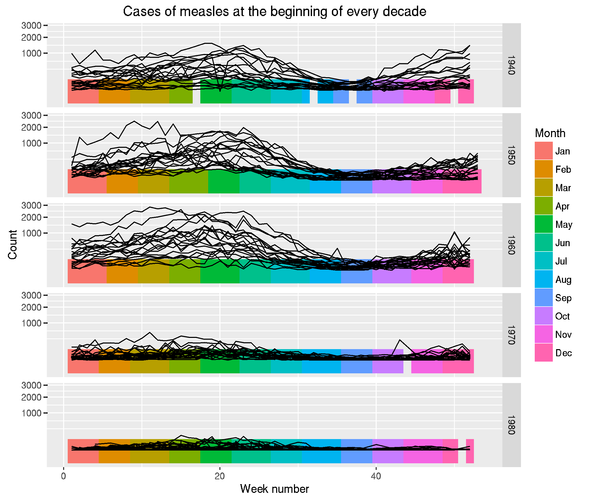
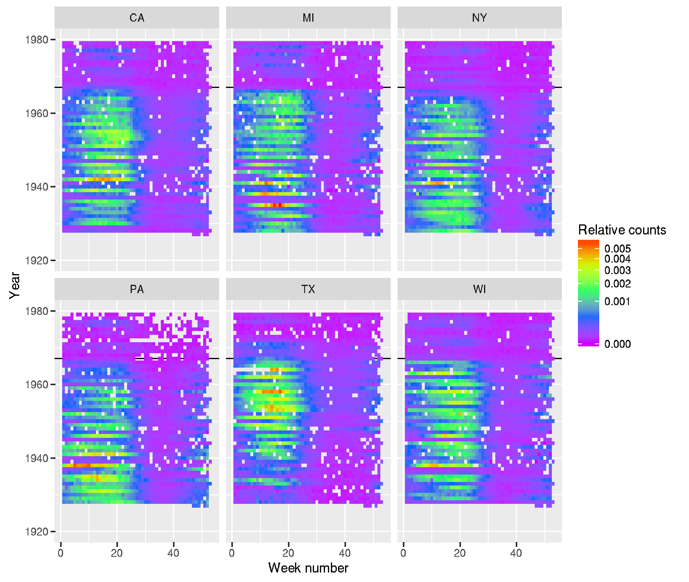

# project-tycho-utilities

Utilities to work with the awesome data from Project Tycho:

Willem G. van Panhuis, John Grefenstette, Su Yon Jung, Nian Shong Chok, Anne Cross, Heather Eng, Bruce Y Lee, Vladimir Zadorozhny, Shawn Brown, Derek Cummings, Donald S. Burke. Contagious Diseases in the United States from 1888 to the present. NEJM 2013; 369(22): 2152-2158.

At this point, this is only building an SQLite database from the Level 2 data (downloading the data). Easy to run though:

## Requirements

- make
- wget
- unzip
- gzip
- python3

This repository was initially used in a workshop on polyglot data analysis
as the Boston Data Festival 2016
([slides](http://lgautier.github.io/odsc-ppda-slides/),
[repos for the slides](https://github.com/lgautier/odsc-ppda-slides))

A jupyter notebook showing how dplyr and ggplot2 can be used to analyze data
is included in the directory [notebook/](notebook/).

## Usage

Building the SQLite database with Level 2 data from Project Tycho is as
simple as writing the following from the source directory:

```sh
make all
```

This will download the Level 2 data (if not already found locally) and
run a Python script that builds the database into a file called `tycho.db`
(or any other name present in the environment variable `DBNAME`).

The SQLite database can then be used as (easily as) as any SQLite database
can be:

```sh
sqlite3 tycho.db \
  "SELECT count(*) "`
  `"FROM casecount "`
  `"INNER JOIN location "`
  `"ON casecount.location_id=location.id "`
  `"WHERE location.state='MA'"

```

### R

With R, dplyr, magrittr, and ggplot2:

```R
library(dplyr)
dbfilename <- "tycho.db"
datasrc <- dplyr::src_sqlite(dbfilename)
disease_tbl <- dplyr::tbl(datasrc, "disease")
casecount_tbl <- dplyr::tbl(datasrc, "casecount")
location_tbl <- dplyr::tbl(datasrc, "location")

library(magrittr)
# Get the locations (states only, that is locations for which
# the attribute "city" is missing) ordered by the largest number
# of recorded cases of MEASLES
res <- casecount_tbl %>%
  dplyr::inner_join(disease_tbl, by=c("disease_id"="id")) %>%
  dplyr::filter(name=="MEASLES") %>%
  dplyr::group_by(location_id, disease_id) %>%
  dplyr::summarize(sumcount=sum(count)) %>%
  dplyr::arrange( desc(sumcount))

top_locations <- res %>%
  dplyr::ungroup() %>%
  dplyr::inner_join(location_tbl, by=c("location_id"="id")) %>%
  dplyr::filter(is.na(city)) %>%
  head(20) %>%
  collect()

# Get the count data for the 20 locations with the largest number
# of cases
dataf <- res %>%
    dplyr::filter(sumcount >= top_locations$sumcount[20]) %>%
    dplyr::inner_join(casecount_tbl,
                      by=c("location_id"="location_id",
	                   "disease_id"="disease_id"))

# prepare data.frame to plot
dataf_plot <- dataf %>%
    dplyr::inner_join(location_tbl, by=c("location_id"="id")) %>%
    dplyr::filter(is.na(city)) %>%
    dplyr::collect() %>%
    dplyr::mutate(date=as.POSIXct(strptime(date_from, format="%Y-%m-%d")),
                  month = format(date, "%m"),
                  year = format(date, "%Y"),
		  weeknum = as.numeric( format(date+3, "%U")))

# plot count every 10 years
library(ggplot2)
p <- ggplot(dataf_plot %>% filter(year %in% seq(1940, 1980, by=10))) +
  geom_tile(aes(x=weeknum, y=0, fill=factor(month, ordered=TRUE)),
            height=20) +
  geom_line(aes(x=weeknum, y=count, group=location_id)) +
  scale_x_continuous("Week number") + 
  scale_y_sqrt("Count") +
  scale_fill_discrete("Month", labels=month.abb) +
  facet_grid(year~.) +
  ggtitle('Cases of measles at the beginning of every decade')
print(p)

```



```r
# plot counts for all years betweem 1920 and 1980 for the
# top 6 locations
dataf <- res %>%
    dplyr::filter(sumcount >= top_locations$sumcount[6]) %>%
    dplyr::inner_join(casecount_tbl,
                      by=c("location_id"="location_id",
	                   "disease_id"="disease_id"))

# prepare data.frame to plot
dataf_plot <- dataf %>%
    dplyr::inner_join(location_tbl, by=c("location_id"="id")) %>%
    dplyr::collect() %>%
    dplyr::mutate(date=as.POSIXct(strptime(date_from, format="%Y-%m-%d")),
                  month = format(date, "%m"),
                  year = format(date, "%Y"),
		  weeknum = as.numeric( format(date+3, "%U")))

p <- ggplot(dataf_plot %>%
	    dplyr::filter(is.na(city))) +
  geom_hline(yintercept=1967) +
  geom_tile(aes(x=weeknum, y=as.integer(year), fill=count/sumcount)) +
  scale_fill_gradientn("Relative counts",
                       trans="sqrt", colors=rev(rainbow(5))) +
  scale_x_continuous("Week number") +
  scale_y_continuous("Year", limits=c(1920, 1980)) +
  facet_wrap(~state)
print(p)

```


